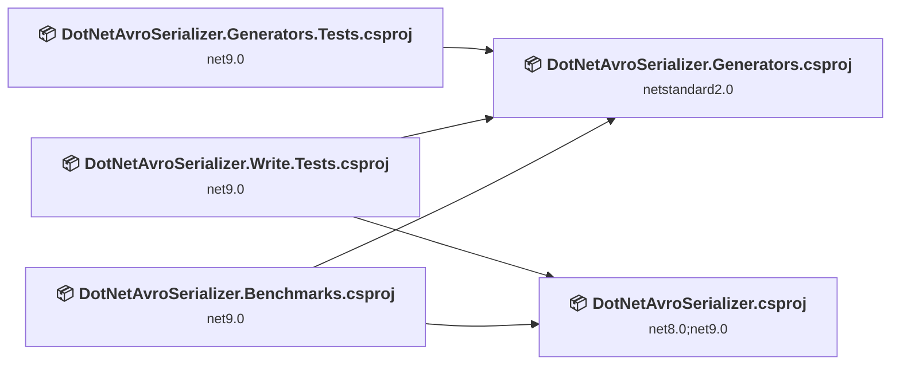
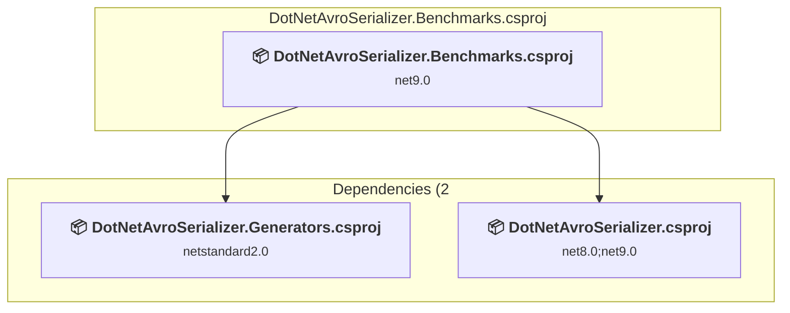
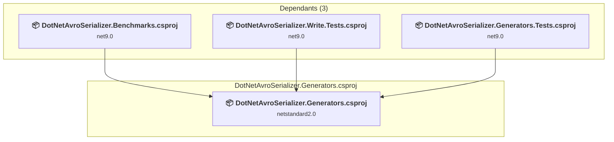
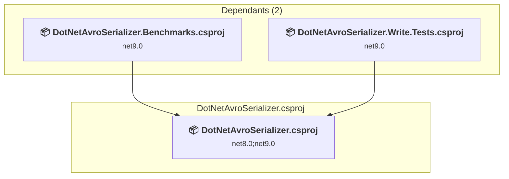
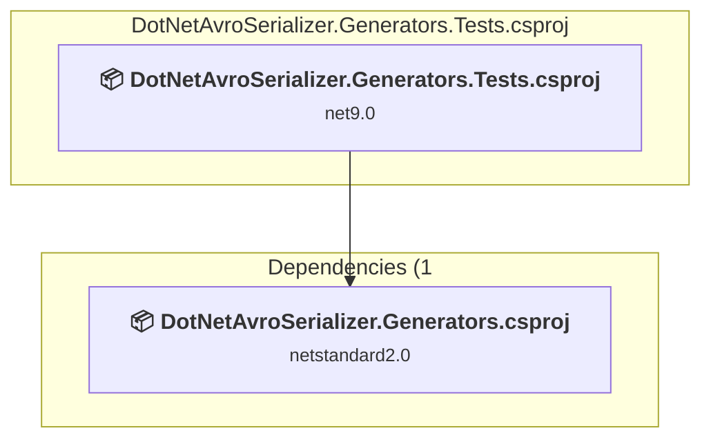
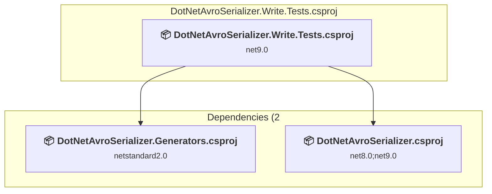

# Projects and dependencies analysis

This document provides a comprehensive overview of the projects and their dependencies in the context of upgrading to .NETCoreApp,Version=v10.0.

## Table of Contents

- [Executive Summary](#executive-Summary)
  - [Highlevel Metrics](#highlevel-metrics)
  - [Projects Compatibility](#projects-compatibility)
  - [Package Compatibility](#package-compatibility)
  - [API Compatibility](#api-compatibility)
- [Aggregate NuGet packages details](#aggregate-nuget-packages-details)
- [Top API Migration Challenges](#top-api-migration-challenges)
  - [Technologies and Features](#technologies-and-features)
  - [Most Frequent API Issues](#most-frequent-api-issues)
- [Projects Relationship Graph](#projects-relationship-graph)
- [Project Details](#project-details)

  - [benchmarks\DotNetAvroSerializer.Benchmarks\DotNetAvroSerializer.Benchmarks.csproj](#benchmarksdotnetavroserializerbenchmarksdotnetavroserializerbenchmarkscsproj)
  - [src\DotNetAvroSerializer.Generators\DotNetAvroSerializer.Generators.csproj](#srcdotnetavroserializergeneratorsdotnetavroserializergeneratorscsproj)
  - [src\DotNetAvroSerializer\DotNetAvroSerializer.csproj](#srcdotnetavroserializerdotnetavroserializercsproj)
  - [tests\DotNetAvroSerializer.Generators.Tests\DotNetAvroSerializer.Generators.Tests.csproj](#testsdotnetavroserializergeneratorstestsdotnetavroserializergeneratorstestscsproj)
  - [tests\DotNetAvroSerializer.Write.Tests\DotNetAvroSerializer.Write.Tests.csproj](#testsdotnetavroserializerwritetestsdotnetavroserializerwritetestscsproj)

## Executive Summary

### Highlevel Metrics

| Metric | Count | Status |
| :--- | :---: | :--- |
| Total Projects | 5 | All require upgrade |
| Total NuGet Packages | 14 | 2 need upgrade |
| Total Code Files | 89 |  |
| Total Code Files with Incidents | 5 |  |
| Total Lines of Code | 4533 |  |
| Total Number of Issues | 7 |  |
| Estimated LOC to modify | 0+ | at least 0.0% of codebase |

### Projects Compatibility

| Project | Target Framework | Difficulty | Package Issues | API Issues | Est. LOC Impact | Description |
| :--- | :---: | :---: | :---: | :---: | :---: | :--- |
| [benchmarks\DotNetAvroSerializer.Benchmarks\DotNetAvroSerializer.Benchmarks.csproj](#benchmarksdotnetavroserializerbenchmarksdotnetavroserializerbenchmarkscsproj) | net9.0 | 🟢 Low | 0 | 0 |  | DotNetCoreApp, Sdk Style = True |
| [src\DotNetAvroSerializer.Generators\DotNetAvroSerializer.Generators.csproj](#srcdotnetavroserializergeneratorsdotnetavroserializergeneratorscsproj) | netstandard2.0 | 🟢 Low | 1 | 0 |  | ClassLibrary, Sdk Style = True |
| [src\DotNetAvroSerializer\DotNetAvroSerializer.csproj](#srcdotnetavroserializerdotnetavroserializercsproj) | net8.0;net9.0 | 🟢 Low | 0 | 0 |  | ClassLibrary, Sdk Style = True |
| [tests\DotNetAvroSerializer.Generators.Tests\DotNetAvroSerializer.Generators.Tests.csproj](#testsdotnetavroserializergeneratorstestsdotnetavroserializergeneratorstestscsproj) | net9.0 | 🟢 Low | 1 | 0 |  | DotNetCoreApp, Sdk Style = True |
| [tests\DotNetAvroSerializer.Write.Tests\DotNetAvroSerializer.Write.Tests.csproj](#testsdotnetavroserializerwritetestsdotnetavroserializerwritetestscsproj) | net9.0 | 🟢 Low | 1 | 0 |  | DotNetCoreApp, Sdk Style = True |

### Package Compatibility

| Status | Count | Percentage |
| :--- | :---: | :---: |
| ✅ Compatible | 12 | 85.7% |
| ⚠️ Incompatible | 1 | 7.1% |
| 🔄 Upgrade Recommended | 1 | 7.1% |
| ***Total NuGet Packages*** | ***14*** | ***100%*** |

### API Compatibility

| Category | Count | Impact |
| :--- | :---: | :--- |
| 🔴 Binary Incompatible | 0 | High - Require code changes |
| 🟡 Source Incompatible | 0 | Medium - Needs re-compilation and potential conflicting API error fixing |
| 🔵 Behavioral change | 0 | Low - Behavioral changes that may require testing at runtime |
| ✅ Compatible | 5261 |  |
| ***Total APIs Analyzed*** | ***5261*** |  |

## Aggregate NuGet packages details

| Package | Current Version | Suggested Version | Projects | Description |
| :--- | :---: | :---: | :--- | :--- |
| Apache.Avro | 1.11.* |  | [DotNetAvroSerializer.Generators.csproj](#srcdotnetavroserializergeneratorsdotnetavroserializergeneratorscsproj) | ✅Compatible |
| BenchmarkDotNet | 0.15.2 |  | [DotNetAvroSerializer.Benchmarks.csproj](#benchmarksdotnetavroserializerbenchmarksdotnetavroserializerbenchmarkscsproj) | ✅Compatible |
| BenchmarkDotNet.Annotations | 0.15.2 |  | [DotNetAvroSerializer.Benchmarks.csproj](#benchmarksdotnetavroserializerbenchmarksdotnetavroserializerbenchmarkscsproj) | ✅Compatible |
| coverlet.collector | 6.0.4 |  | [DotNetAvroSerializer.Generators.Tests.csproj](#testsdotnetavroserializergeneratorstestsdotnetavroserializergeneratorstestscsproj) [DotNetAvroSerializer.Write.Tests.csproj](#testsdotnetavroserializerwritetestsdotnetavroserializerwritetestscsproj) | ✅Compatible |
| FluentAssertions | 6.12.2 |  | [DotNetAvroSerializer.Generators.Tests.csproj](#testsdotnetavroserializergeneratorstestsdotnetavroserializergeneratorstestscsproj) [DotNetAvroSerializer.Write.Tests.csproj](#testsdotnetavroserializerwritetestsdotnetavroserializerwritetestscsproj) | ✅Compatible |
| Microsoft.CodeAnalysis.Analyzers | 3.3.* |  | [DotNetAvroSerializer.Generators.csproj](#srcdotnetavroserializergeneratorsdotnetavroserializergeneratorscsproj) | ✅Compatible |
| Microsoft.CodeAnalysis.Common | 4.14.0 |  | [DotNetAvroSerializer.Generators.Tests.csproj](#testsdotnetavroserializergeneratorstestsdotnetavroserializergeneratorstestscsproj) | ✅Compatible |
| Microsoft.CodeAnalysis.CSharp | 4.2.* |  | [DotNetAvroSerializer.Generators.csproj](#srcdotnetavroserializergeneratorsdotnetavroserializergeneratorscsproj) | ✅Compatible |
| Microsoft.NET.Test.Sdk | 17.14.1 |  | [DotNetAvroSerializer.Generators.Tests.csproj](#testsdotnetavroserializergeneratorstestsdotnetavroserializergeneratorstestscsproj) [DotNetAvroSerializer.Write.Tests.csproj](#testsdotnetavroserializerwritetestsdotnetavroserializerwritetestscsproj) | ✅Compatible |
| Moq | 4.20.72 |  | [DotNetAvroSerializer.Generators.Tests.csproj](#testsdotnetavroserializergeneratorstestsdotnetavroserializergeneratorstestscsproj) | ✅Compatible |
| NETStandard.Library | 2.0.3 |  | [DotNetAvroSerializer.Generators.csproj](#srcdotnetavroserializergeneratorsdotnetavroserializergeneratorscsproj) | ✅Compatible |
| Newtonsoft.Json | 13.0.* | 13.0.4 | [DotNetAvroSerializer.Generators.csproj](#srcdotnetavroserializergeneratorsdotnetavroserializergeneratorscsproj) | NuGet package upgrade is recommended |
| xunit | 2.9.3 |  | [DotNetAvroSerializer.Generators.Tests.csproj](#testsdotnetavroserializergeneratorstestsdotnetavroserializergeneratorstestscsproj) [DotNetAvroSerializer.Write.Tests.csproj](#testsdotnetavroserializerwritetestsdotnetavroserializerwritetestscsproj) | ⚠️NuGet package is deprecated |
| xunit.runner.visualstudio | 3.1.1 |  | [DotNetAvroSerializer.Generators.Tests.csproj](#testsdotnetavroserializergeneratorstestsdotnetavroserializergeneratorstestscsproj) [DotNetAvroSerializer.Write.Tests.csproj](#testsdotnetavroserializerwritetestsdotnetavroserializerwritetestscsproj) | ✅Compatible |

## Top API Migration Challenges

### Technologies and Features

| Technology | Issues | Percentage | Migration Path |
| :--- | :---: | :---: | :--- |

### Most Frequent API Issues

| API | Count | Percentage | Category |
| :--- | :---: | :---: | :--- |

## Projects Relationship Graph

Legend:
📦 SDK-style project
⚙️ Classic project

## Project Details

### benchmarks\DotNetAvroSerializer.Benchmarks\DotNetAvroSerializer.Benchmarks.csproj

#### Project Info

- **Current Target Framework:** net9.0
- **Proposed Target Framework:** net10.0
- **SDK-style**: True
- **Project Kind:** DotNetCoreApp
- **Dependencies**: 2
- **Dependants**: 0
- **Number of Files**: 5
- **Number of Files with Incidents**: 1
- **Lines of Code**: 214
- **Estimated LOC to modify**: 0+ (at least 0.0% of the project)

#### Dependency Graph

Legend:
📦 SDK-style project
⚙️ Classic project

### API Compatibility

| Category | Count | Impact |
| :--- | :---: | :--- |
| 🔴 Binary Incompatible | 0 | High - Require code changes |
| 🟡 Source Incompatible | 0 | Medium - Needs re-compilation and potential conflicting API error fixing |
| 🔵 Behavioral change | 0 | Low - Behavioral changes that may require testing at runtime |
| ✅ Compatible | 197 |  |
| ***Total APIs Analyzed*** | ***197*** |  |

### src\DotNetAvroSerializer.Generators\DotNetAvroSerializer.Generators.csproj

#### Project Info

- **Current Target Framework:** netstandard2.0✅
- **SDK-style**: True
- **Project Kind:** ClassLibrary
- **Dependencies**: 0
- **Dependants**: 3
- **Number of Files**: 39
- **Number of Files with Incidents**: 1
- **Lines of Code**: 1998
- **Estimated LOC to modify**: 0+ (at least 0.0% of the project)

#### Dependency Graph

Legend:
📦 SDK-style project
⚙️ Classic project

### API Compatibility

| Category | Count | Impact |
| :--- | :---: | :--- |
| 🔴 Binary Incompatible | 0 | High - Require code changes |
| 🟡 Source Incompatible | 0 | Medium - Needs re-compilation and potential conflicting API error fixing |
| 🔵 Behavioral change | 0 | Low - Behavioral changes that may require testing at runtime |
| ✅ Compatible | 2670 |  |
| ***Total APIs Analyzed*** | ***2670*** |  |

### src\DotNetAvroSerializer\DotNetAvroSerializer.csproj

#### Project Info

- **Current Target Framework:** net8.0;net9.0
- **Proposed Target Framework:** net8.0;net9.0;net10.0
- **SDK-style**: True
- **Project Kind:** ClassLibrary
- **Dependencies**: 0
- **Dependants**: 2
- **Number of Files**: 27
- **Number of Files with Incidents**: 1
- **Lines of Code**: 619
- **Estimated LOC to modify**: 0+ (at least 0.0% of the project)

#### Dependency Graph

Legend:
📦 SDK-style project
⚙️ Classic project

### API Compatibility

| Category | Count | Impact |
| :--- | :---: | :--- |
| 🔴 Binary Incompatible | 0 | High - Require code changes |
| 🟡 Source Incompatible | 0 | Medium - Needs re-compilation and potential conflicting API error fixing |
| 🔵 Behavioral change | 0 | Low - Behavioral changes that may require testing at runtime |
| ✅ Compatible | 405 |  |
| ***Total APIs Analyzed*** | ***405*** |  |

### tests\DotNetAvroSerializer.Generators.Tests\DotNetAvroSerializer.Generators.Tests.csproj

#### Project Info

- **Current Target Framework:** net9.0
- **Proposed Target Framework:** net10.0
- **SDK-style**: True
- **Project Kind:** DotNetCoreApp
- **Dependencies**: 1
- **Dependants**: 0
- **Number of Files**: 6
- **Number of Files with Incidents**: 1
- **Lines of Code**: 114
- **Estimated LOC to modify**: 0+ (at least 0.0% of the project)

#### Dependency Graph

Legend:
📦 SDK-style project
⚙️ Classic project

### API Compatibility

| Category | Count | Impact |
| :--- | :---: | :--- |
| 🔴 Binary Incompatible | 0 | High - Require code changes |
| 🟡 Source Incompatible | 0 | Medium - Needs re-compilation and potential conflicting API error fixing |
| 🔵 Behavioral change | 0 | Low - Behavioral changes that may require testing at runtime |
| ✅ Compatible | 176 |  |
| ***Total APIs Analyzed*** | ***176*** |  |

### tests\DotNetAvroSerializer.Write.Tests\DotNetAvroSerializer.Write.Tests.csproj

#### Project Info

- **Current Target Framework:** net9.0
- **Proposed Target Framework:** net10.0
- **SDK-style**: True
- **Project Kind:** DotNetCoreApp
- **Dependencies**: 2
- **Dependants**: 0
- **Number of Files**: 16
- **Number of Files with Incidents**: 1
- **Lines of Code**: 1588
- **Estimated LOC to modify**: 0+ (at least 0.0% of the project)

#### Dependency Graph

Legend:
📦 SDK-style project
⚙️ Classic project

### API Compatibility

| Category | Count | Impact |
| :--- | :---: | :--- |
| 🔴 Binary Incompatible | 0 | High - Require code changes |
| 🟡 Source Incompatible | 0 | Medium - Needs re-compilation and potential conflicting API error fixing |
| 🔵 Behavioral change | 0 | Low - Behavioral changes that may require testing at runtime |
| ✅ Compatible | 1813 |  |
| ***Total APIs Analyzed*** | ***1813*** |  |

